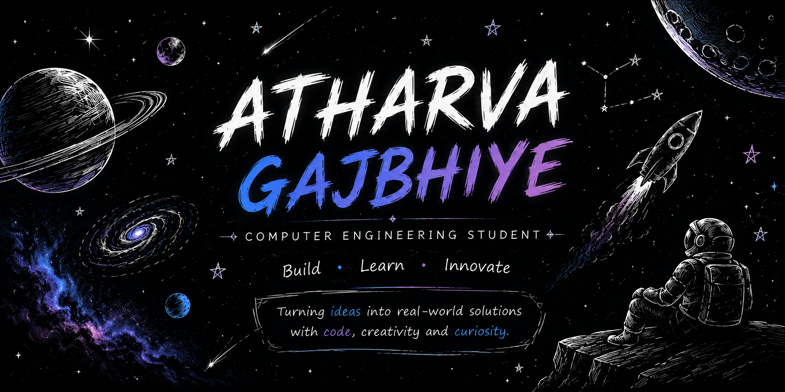

<p align="center">
  
</p>

<h1 align="center">Hi 👋, I'm Atharva Gajbhiye</h1>

<h3 align="center">
Computer Engineering Student • Building Real-World Software • Exploring AI & Backend Systems
</h3>

<p align="center">
Building software that solves real-world problems through code, curiosity, and continuous learning.
</p>

---

# 👨‍💻 About Me

```java
public class Atharva {

    String education = "B.Tech Computer Engineering";

    String college = "MIT Academy of Engineering";

    String location = "Pune, India";

    String[] interests = {
        "Full-Stack Development",
        "Backend Engineering",
        "Artificial Intelligence",
        "System Design",
        "Cyber Security",
        "Open Source"
    };

    String[] currentlyLearning = {
        "Java DSA",
        "Docker",
        "AWS",
        "Redis",
        "Kubernetes",
        "AI Agents",
        "Model Context Protocol"
    };

    void dailyRoutine() {

        while(true){

            learn();

            build();

            improve();

            repeat();

        }

    }

}
```

---

# 💻 Tech Stack

### Languages

<p>

</p>

### Frontend

<p>

</p>

### Backend

<p>

</p>

### Tools

<p>

</p>

---

# 🚀 Featured Projects

## 🤖 Micro Internship Portal

AI-powered internship platform connecting students with organizations.

### Features

- AI-powered internship recommendations
- Student Dashboard
- Organization Dashboard
- Admin Panel
- Firebase Authentication
- Role-Based Access Control
- Responsive UI
- REST API Integration

**Tech Used**

`React` • `Node.js` • `Firebase` • `Express.js` • `AI`

---

## 🏠 Smart Settle

A hostel discovery platform helping students find nearby accommodations.

### Features

- Search & Filter
- Responsive Design
- Clean UI
- Mobile Friendly

**Tech Used**

`HTML` • `CSS` • `JavaScript`

---

# 📚 Current Learning

- ☕ Java & Advanced DSA
- ⚙ Backend Development
- 🧠 System Design
- 🐳 Docker
- ☁ AWS
- ☸ Kubernetes
- 🔴 Redis
- 🤖 AI Agents
- 🔗 Model Context Protocol (MCP)

---

# 🎯 Goals for 2026

- ✅ Become proficient in Java
- ✅ Master Data Structures & Algorithms
- ✅ Build Production-Ready Backend Systems
- ✅ Learn Cloud & DevOps
- ✅ Contribute to Open Source
- ✅ Build AI-Powered SaaS Projects
- ✅ Crack a Product-Based Company Internship

---

# 🏆 Certifications & Learning

- Cisco Networking Academy – Cyber Security
- Cisco Networking Academy – Python Essentials
- Anthropic – AI Fluency
- Anthropic – Claude Code
- Anthropic – Model Context Protocol (MCP)
- NVIDIA – Fundamentals of Deep Learning
- L&T EduTech – IoT Architectural Engineering

---

# 🌱 Philosophy

> "Learn. Build. Improve. Repeat."

I believe the best way to learn software engineering is by building projects, experimenting with new technologies, solving real-world problems, and continuously improving every day.

---

# 🤝 Connect With Me

<p align="center">

<a href="https://www.linkedin.com/in/atharva-gajbhiye-3545073a6">

</a>

<a href="https://github.com/atharva-21tootop">

</a>

<a href="mailto:atharvagajbhiye21@gmail.com">

</a>

</p>

<p align="center">

📍 Pune, Maharashtra, India

📧 **atharvagajbhiye21@gmail.com**

</p>

---

<p align="center">

### ⭐ Thanks for visiting my GitHub profile!

*"Turning ideas into real-world software, one project at a time."*

</p>
